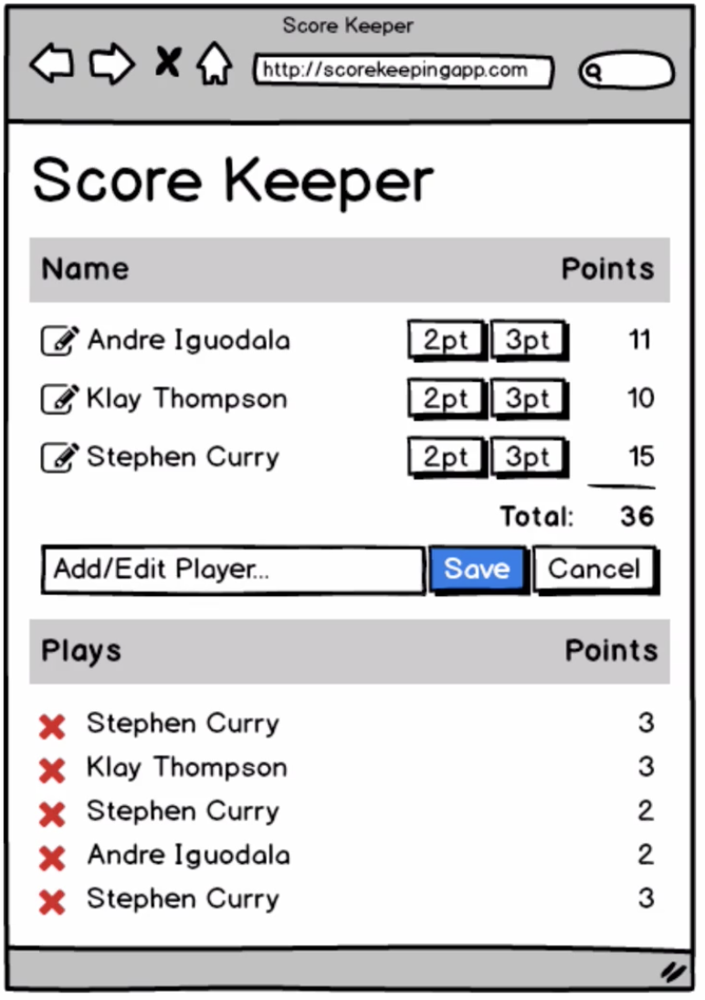

# A Basketball Scorekeeping App in Elm

<figure> 
  
  <figcaption>Mockup</figcaption>
</figure>

To develop/run: `$ gulp`

By default the app should be available on `localhost:4000` and the gulp config includes a watcher so that the app is recompiled every time a file is touched.

(You must still reload the app in the browser though)

Take a look at `basketball_scorekeeper.org` or maybe `PLAN.md` to see planning/progress
